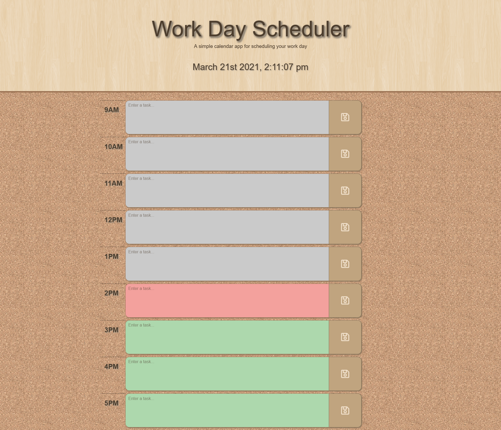

# Work Day Schedular

### About:
This is a daily work scheduler to organize and plan out the events during the day. The hours are between 7.00-17.00 which I considered as standard working hours for most people, the times could be adjusted and even be 24-hours if needed. I've used `jQuery`, `Moment.js` and `Bootstrap` for the first time to create this app, I've learned a lot from troubleshooting to get the `localStorage` working properly. 

### Usage:
- Enter any value on the hourly text areas,
- Press the *save-icon* button to save the entered value,
- The hours are *color-coded*; pastime is colored gray, present is red and the future is green.
- The entered value will be stored permanently until changed.

### Improvements:
>I've noticed different browsers act different on many situations, this could be the `localStorage` to even the layout of the page. Unfortunately, getting it working exactly the same for all the different browser types is something I have to work on. For now, I realized it's not fully responsive to all screen sizes even with using `Bootstrap`.

### Webpage:
https://kemaldemirgil.github.io/work-day-scheduler/

### License:

Copyright © Kemal Demirgil. All rights reserved.
Licensed under the [MIT](https://github.com/kemaldemirgil/work-day-schedular/blob/main/LICENSE) license.
